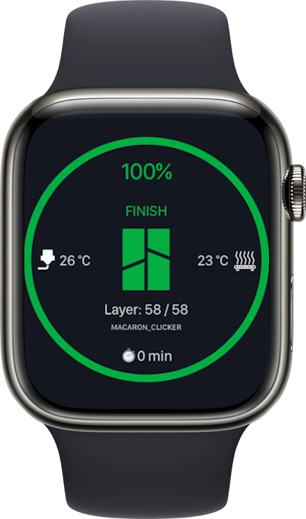

# BambuLanViewer

A real-time 3D printer monitoring dashboard for Bambu Lab printers, built with Blazor and .NET 10. Connects directly to your printer via MQTT to display print progress, temperatures, layer information, and more — all without requiring Bambu Cloud connectivity.


## 📸 Screenshots

<!-- Add your screenshots here -->
<!-- 
To add screenshots:
1. Take a screenshot of the application running
2. Save it to an `images/` folder in this repository
3. Update the image paths below
-->

<div align="center">
  
  <p><em>Real-time print progress display with circular progress ring</em></p>
</div>

<div align="center">
  
  <p><em>Responsive design works great on mobile devices and Apple Watch</em></p>
</div>

## ✨ Features

- **Real-time monitoring** — Live updates directly from your printer via MQTT
- **Circular progress display** — Beautiful radial progress ring showing print completion
- **Temperature tracking** — Monitor both nozzle and bed temperatures in real-time
- **Layer information** — Current layer vs. total layers displayed prominently
- **Time remaining** — Estimated minutes left for current print job
- **Object name** — Displays the name of the currently printing object
- **Dark theme** — Easy on the eyes with Pico CSS dark mode
- **Responsive design** — Works on desktop, tablet, and mobile devices including Apple Watch
- **Automatic reconnection** — Blazor reconnect modal handles disconnections gracefully

## 🖥️ What Does It Show?

The dashboard displays all essential print information in a clean circular layout:

| Position | Information |
|----------|-------------|
| Center (top) | Print completion percentage (%) |
| Left side | Nozzle temperature (°C) 🔴 |
| Center | Current layer / Total layers |
| Right side | Bed temperature (°C) 🟠 |
| Bottom | Remaining time (minutes) ⏱️ |
| Below ring | Object name and print status |

## 🚀 Quick Start with Docker Compose

### Prerequisites

- Docker installed on your system
- Bambu Lab 3D printer connected to the same network as your Docker host

### Required Configuration

You need three pieces of information from your Bambu Lab setup:

1. **Printer IP Address** — Your printer's local network IP (e.g., `192.168.1.100`)
2. **Access Code** — Found in the Bambu Cloud app or web interface under device settings
3. **Serial Number** — Located on your printer or in the Bambu Cloud app

### Docker Compose Setup

#### Option 1: Using Environment Variables (Recommended)

Create a `.env` file in the project root with your configuration:

```bash
# .env file - DO NOT commit to version control
BambuMttqClient__IPAddress=192.168.1.100
BambuMttqClient__AccessCode=your_access_code_here
BambuMttqClient__SerialNumber=your_serial_number_here
```

Then run:

```bash
docker-compose up -d
```

#### Option 2: Using docker-compose.yml Directly

Edit the `docker-compose.yml` file and replace the placeholder values:

```yaml
services:
  bambulanviewer:
    build: .
    container_name: BambuLanViewer
    restart: unless-stopped
    networks:
      - virtual-network
    ports:
      - "8080:8080"
    environment:
      - BambuMttqClient__IPAddress=192.168.1.100
      - BambuMttqClient__AccessCode=your_access_code_here
      - BambuMttqClient__SerialNumber=your_serial_number_here

networks:
  virtual-network:
    external: true
```

> **Note:** The default configuration uses an external Docker network called `virtual-network`. You can either create this network or modify the compose file to use a different network.

### Accessing the Application

Once running, open your browser and navigate to:

```
http://localhost:8080
```

## 🍎 Apple Watch Support

BambuLanViewer is optimized for small screens including the Apple Watch! The responsive design automatically scales the progress ring and information to fit any display size.

### Setting up on Apple Watch

1. **Host BambuLanViewer** — Run it via Docker Compose on a device accessible from your watch's network
2. **Add to Favorites** — Open Safari on your iPhone, navigate to `http://your-server-ip:8080`, and add to favorites
3. **Access from Watch** — Open the Shortcuts app on Apple Watch and create a shortcut that opens the BambuLanViewer URL

### Creating an Apple Watch Shortcut

1. Open the **Shortcuts** app on your iPhone
2. Tap **+** to create a new shortcut
3. Name it "Bambu Printer" or similar
4. Add action: **Open URL**
5. Enter your BambuLanViewer URL (e.g., `http://192.168.1.100:8080`)
6. Save the shortcut
7. The shortcut will sync to your Apple Watch

### Adding as Home Screen Widget

For quick access on your watch face:

1. Add a **Web View** complication or widget (if available in your watchOS version)
2. Point it to your BambuLanViewer URL
3. Now you can see print progress at a glance!

## 🛠️ Development Setup

### Prerequisites

- [.NET 10 SDK](https://dotnet.microsoft.com/download/dotnet/10) installed
- Visual Studio Code or Visual Studio (optional but recommended)

### Running Locally

```bash
# Clone the repository
git clone https://github.com/yourusername/BambuLanView.git
cd BambuLanView

# Configure your printer settings in appsettings.Development.json
# Update the BambuMttqClient section with your printer details

# Run the application
dotnet run --project BambuLanViewer
```

The application will start on `https://localhost:5001` (or similar).

## ⚙️ Configuration Reference

### Environment Variables for Docker Compose

| Variable | Required | Description | Example |
|----------|----------|-------------|---------|
| `BambuMttqClient__IPAddress` | ✅ | Your Bambu printer's local IP address | `192.168.1.100` |
| `BambuMttqClient__AccessCode` | ✅ | Access code from Bambu Cloud app | `your_access_code_here` |
| `BambuMttqClient__SerialNumber` | ✅ | Printer's serial number | `your_serial_number_here` |

> **Note:** Docker Compose uses double underscores (`__`) to represent nested configuration sections. These map to the JSON structure in `appsettings.json`.

### appsettings Configuration (for local development)

```json
{
  "BambuMttqClient": {
    "IPAddress": "192.168.1.100",
    "AccessCode": "your_access_code_here",
    "SerialNumber": "your_serial_number_here"
  }
}
```

## 🔧 Troubleshooting

### Connection Issues

- **Printer not reachable**: Ensure your Docker container and printer are on the same network
- **Authentication failed**: Verify your access code is correct (case-sensitive)
- **No data received**: Check that your serial number matches exactly with what's in Bambu Cloud app

### Apple Watch Specific

- **Page doesn't load**: Make sure your watch can reach the server IP address
- **Content too small**: The interface auto-scales, but you may need to adjust zoom settings in Safari on your watch

## 📝 License

This project is licensed under the MIT License - see the [LICENSE](LICENSE) file for details.

## 🙏 Acknowledgments

- [Bambu Lab](https://bambulab.com/) for making their printers accessible via MQTT
- [.NET Foundation](https://dotnetfoundation.org/) for the amazing Blazor framework
- [Pico CSS](https://picocss.com/) for the lightweight styling framework

---

**Made with ❤️ for 3D printing enthusiasts**
